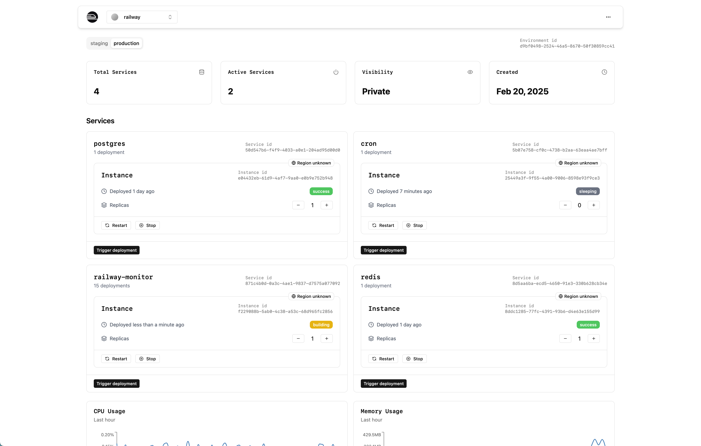

<p align="center">
 <h1 align="center"><b>Railway Monitor</b></h1>
<p align="center">
    Simple dashboard built on top of Railway's Public API.
    <br />
    <br />
    <a href="#prerequisites"><strong>Prerequisites</strong></a> ·
    <a href="#initial-setup"><strong>Initial setup</strong></a> ·
  </p>
</p>

Simple dashboard built on top of Railway's Public API.

## 1. Setup Instructions

### Prerequisites

- pnpm (Install with: npm install -g pnpm)
- Git
- Railway API account token

### Initial Setup

1. Clone the repository:
`git clone git@github.com:BartoszJarocki/railway-watch.git`
`cd railway-monitor`

2. Install dependencies:
`pnpm install`

3. Environment Configuration:
Create a `.env.local` file in the root directory:

```
RAILWAY_API_ACCOUNT_TOKEN=<your-token>
```

4. Start development server:
`pnpm dev`

The application will be available at <http://localhost:3000>

### Build for Production

`pnpm build`
`pnpm start`

## 2. Project Structure Overview

```
src/
├── app/                    # Next.js app directory
│   ├── (internal)/        # Protected routes
│   ├── api/               # API routes
│   │   ├── graphql/      # GraphQL API endpoint
│   │   └── rest/         # REST API endpoints
│   └── layout.tsx        # Root layout
├── components/            # Shared components
│   ├── brand/            # Branding components
│   ├── context/          # Context providers
│   └── ui/               # UI components library
├── hooks/                # Custom React hooks
└── lib/                  # Utility functions and configurations
    ├── data/            # Static data
    └── network/         # Network related code
        ├── env/        # Environment configuration
        └── gql/        # GraphQL types and operations
```

## 3. Development Workflow

### Code Organization

1. Components
   - Place reusable UI components in src/components/ui/
   - Place page-specific components in their respective page directories
   - Use the shadcn/ui component system for consistent styling

2. GraphQL Operations
   - Define operations in src/lib/network/operations.ts
   - Generate types using GraphQL Codegen: `pnpm generate-gql-types`

3. Styling
   - Use Tailwind CSS for styling
   - Follow the design system defined in the UI components
   - Use the `cn()` utility for conditional class names

### Development Process

1. Create a new feature branch
2. Implement changes following the project structure
3. Run tests and linting:
   `pnpm lint`
4. Format code:
   `pnpm format`
5. Submit pull request

### Package Management

- Add new dependencies: `pnpm add <package-name>`
- Add dev dependencies: `pnpm add -D <package-name>`
- Update dependencies: `pnpm update`
- Clean install: `pnpm install --frozen-lockfile`

## 5. Common Troubleshooting Steps

### API Connection Issues

1. Verify Railway API token is correctly set in environment variables
2. Check API endpoint status
3. Verify network connectivity
4. Check request/response in browser developer tools

### Build Issues

1. Clear .next directory
2. Delete node_modules and pnpm-store
3. Run pnpm store prune
4. Fresh install with pnpm install --frozen-lockfile
5. Verify TypeScript compilation
6. Check for conflicting dependencies
